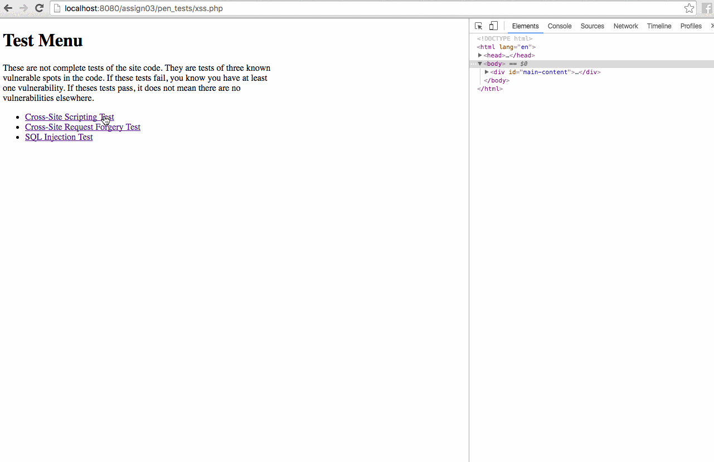

# Project 3 - Globitek Forgery, Theft, and Hijacking Prevention

Time spent: **7** hours spent in total

## User Stories

The following **required** functionality is completed:

**(all required stories completed)**

- [x] Test for vulnerabilities
- [x] Configure sessions
- [x] Login page
- [x] Require login to access staff area pages
- [x] Logout page
- [x] Add CSRF protections to the state forms
- [x] Ensure the application is not vulnerable to XSS attacks
- [x] Ensure the application is not vulnerable to SQL Injection attacks
- [x] Run all tests from Objective 1 again and confirm that your application is no longer vulnerable to any test

The following advanced user stories are optional:

**(all optional stories completed)**

- [x] Bonus 1: Objective 4 (requiring login on staff pages) has a major security weakness because it does not follow one of the fundamental security principals. Identify the principal and write a short description of how the code could be modified to be more secure. Include your answer in the README file that accompanies your assignment submission
  - [x] **(explanation in Notes section)**
- [x] Bonus 2: Add CSRF tokens and protections to all of the forms in the staff directory (new, edit, delete). Make sure the request is the same domain and that the CSRF token is valid
- [x] Bonus 3: Add code so that CSRF tokens will only be considered valid for 10 minutes after creation
- [x] Bonus 4: Only consider a session valid if the user-agent string matches the value used when the user last logged in successfully.
- [x] Advanced: Create two new pages called "public/set_secret_cookie.php" and "public/get_secret_cookie.php". The first page will set a cookie with the name "scrt" and the value "I have a secret to tell.". Before storing the cookie, you need to both encrypt it and sign it. You can use any (two-way) encryption algorithm you prefer. When the second page loads, it should read the cookie with the name "scrt", and then—if it is signed correctly—decrypt it. If it is not signed correctly then it should display an error message and skip decryption altogether.

## Video Walkthrough

Here's a walkthrough of implemented user stories:

GIF created with [LiceCap](http://www.cockos.com/licecap/).

## Notes

* **Bonus Objective 1:** Requiring login on staff pages violates the Fundamental Security Principal of "Prefer whitelisting over blacklisting." In order to designate that a page is secure, the current implementation requires that you specifically mark it as secure, aka blacklisting it. This approach could fail if a new page is added under the staff directory, and the developer forgets to add the blacklist to that page, allowing any user to access it. A better approach would be to designate pages that **don't** need authentication, so that the default state for any new page would be secure.
* In order to complete the set_secret_cookie advanced story, I had to download the mcrypt php plugin (sudo apt-get install php7.0-mcrypt). You may need to download it as well, if you haven't already.
* In login.php, I included separate error messages for an incorrect username vs an incorrect password, since it was explicitly noted in the requirements. In production, however, this decision would come down to the decision to prioritize security or user experience.
* In request_is_same_domain in functions.php I changed HOST_NAME to SERVER_NAME because the former included the 8080 port when accessing localhost (which doesn't appear in HTTP_REFERER).
* When I was testing the site on different browsers, I discovered a bug on the pen_tests pages when using firefox. The <script> tag would always load before the <iframe> tag (see [here](http://stackoverflow.com/questions/8996852/load-and-execute-order-of-scripts)) causing the page to infinitely reload. I included a slight modification to these pages that prevents this, as well as prevents the initial undefined error from the $msg variable. 

## License

    Copyright [2016] [David Maydew]

    Licensed under the Apache License, Version 2.0 (the "License");
    you may not use this file except in compliance with the License.
    You may obtain a copy of the License at

        http://www.apache.org/licenses/LICENSE-2.0

    Unless required by applicable law or agreed to in writing, software
    distributed under the License is distributed on an "AS IS" BASIS,
    WITHOUT WARRANTIES OR CONDITIONS OF ANY KIND, either express or implied.
    See the License for the specific language governing permissions and
    limitations under the License.
